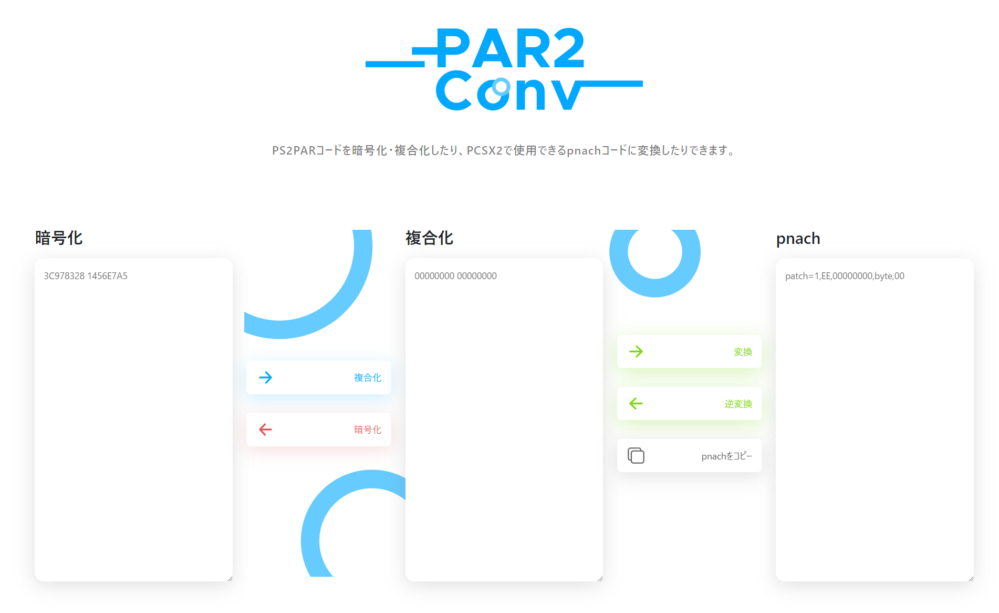

# PS2PAR



## What is this
This is a converter which can encode/decode PS2PAR code or convert/deconvert to pnach code used in PCSX2.

## How to build
```
yarn install
```

### Compiles and hot-reloads for development
```
yarn serve
```

### Compiles and minifies for production
```
yarn build
```

### Customize configuration
See [Configuration Reference](https://cli.vuejs.org/config/).
